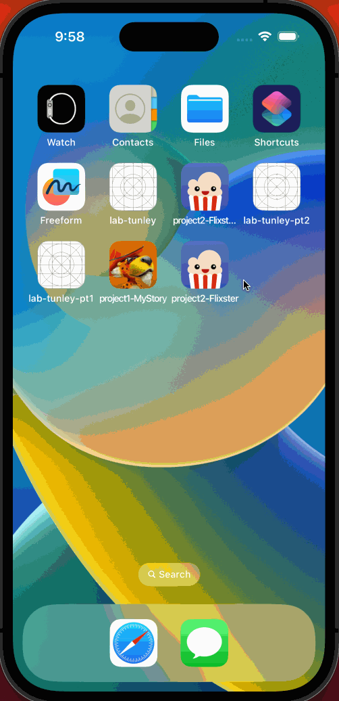
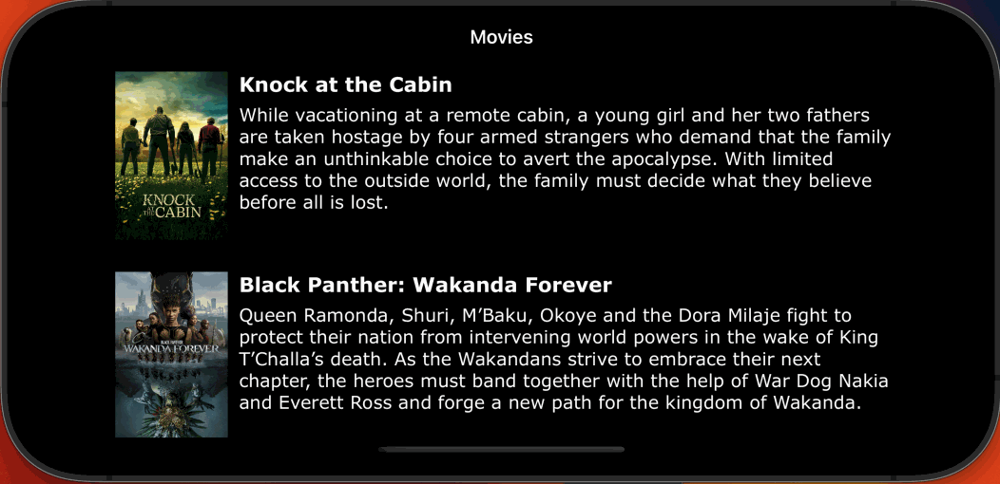

# Project 3 - *Flixster*

Submitted by: **Kelly Bonilla Guzmán**

**Flixster** is a movie browsing app that provides users detailed information on movies currently playing in theatres by fetching data in real time from The Movie Database (TMBD) API. This information includes the movies titles, description, vote average, vote count, popularity, poster image, and backdrop image. 

Time spent: **5** hours spent in total

## Required Features

The following **required** functionality is completed:

- [X] Implement network call and table view to display a list of movies currently playing (title, description, image)
- [X] App has a collection view with the same list of movies
- [X] Uses a tab bar controller to switch between collection view and table view screens
 
The following **optional** features are implemented:

- [ ] Make an additional network call to another end-point.	
- [ ] Allow users to scroll when context items are off-screen (table view implementation)

The following **additional** features are implemented:

- [X] Allow users to scroll when context items are off-screen (scroll view implementation)

## Video Walkthrough

Here's a walkthrough of implemented user stories:

<!-- Replace this with whatever GIF tool you used! -->
GIF created with LICEcap  
<!-- Recommended tools:
[Kap](https://getkap.co/) for macOS
[ScreenToGif](https://www.screentogif.com/) for Windows
[peek](https://github.com/phw/peek) for Linux. -->

## Notes

While continuing to build Flixster, I encountered challenges with passing data from the collection view controller to the detail view controller. This week's project was the first time I had to call on knowledge from the previous weeks on top of this week in order to successfully complete my project. Nonetheless, this week's project was also the first time I felt like I truly understood everything I was implementing in my project. I'm glad that the final part of Flixster required me to put together all of the information from weeks 1 through 3 as its infinitely improved my knowledge of Swift and working in Xcode.

## License

    Copyright 2023 Kelly Bonilla Guzman

    Licensed under the Apache License, Version 2.0 (the "License");
    you may not use this file except in compliance with the License.
    You may obtain a copy of the License at

        http://www.apache.org/licenses/LICENSE-2.0

    Unless required by applicable law or agreed to in writing, software
    distributed under the License is distributed on an "AS IS" BASIS,
    WITHOUT WARRANTIES OR CONDITIONS OF ANY KIND, either express or implied.
    See the License for the specific language governing permissions and
    limitations under the License.

# Project 2 - *Flixster*

Submitted by: **Kelly Bonilla Guzman**

*Flixster* is a movie browsing app that provides users detailed information on the latest movies. This information includes the movies titles,
description, vote average, vote count, popularity, poster image, and backdrop image.

Time spent: **10** hours spent in total

## Required Features

The following **required** functionality is completed:

- [X] Users are able to see a customized app icon and launch screen
- [X] Your app should work for any screen size and orientation using AutoLayout constraints
  - [X] Mark here if you will demostrate auto layout implemention as horizontal rotation or different phone size or both, then erase this text
- [X] Displays at least 5 different movies in a table view
- [X] Can tap into detail view of movie with a full description, backdrop image, and title
 
The following **optional** features are implemented:

- [X] Unique UI changes, such as background, font/color changes, etc.
- [ ] User implements a collection view
- [ ] User implemenets tab bar controller with at least two screens

The following **additional** features are implemented:

- [ ] List anything else that you can get done to improve the app functionality!

## Video Walkthrough

Here's a walkthrough of implemented user stories:

<!-- Replace this with whatever GIF tool you used! -->
GIF created with LICEcap 
<!-- Recommended tools:
[Kap](https://getkap.co/) for macOS
[ScreenToGif](https://www.screentogif.com/) for Windows
[peek](https://github.com/phw/peek) for Linux. -->

## Notes

While building Flixster, I encountered challenges with Autolayout constraints. Specifically, I struggled to display the content of my DetailViewController in different device sizes and orientations. Resultantly, I changed my approach and implemented a scroll view in my DetailViewController with a different set of Autolayout constraints. This resolved my challenge, which allowed me to achieve full functionality!

## License

    Copyright 2023 Kelly Bonilla Guzmán

    Licensed under the Apache License, Version 2.0 (the "License");
    you may not use this file except in compliance with the License.
    You may obtain a copy of the License at

        http://www.apache.org/licenses/LICENSE-2.0

    Unless required by applicable law or agreed to in writing, software
    distributed under the License is distributed on an "AS IS" BASIS,
    WITHOUT WARRANTIES OR CONDITIONS OF ANY KIND, either express or implied.
    See the License for the specific language governing permissions and
    limitations under the License.
